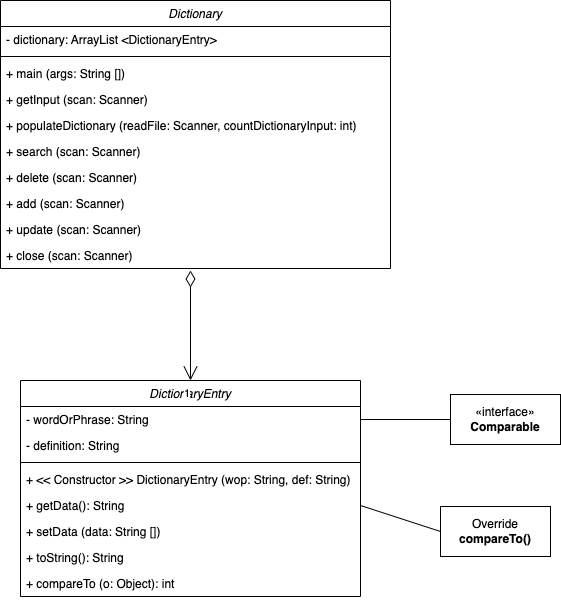

# Dynamic Dictionary
This is a user-friendly Slang Dictionary program. 
## I. Populate Dictionary
- <ins>**Populate**</ins> the dictionary by prompting for the name(s) of a file
- <ins>**Read in the data**</ins> and store in the dictionary
- Once the user finishes populating, the program <ins>**sorts**</ins> the dictionary into lexically ascending order
## II. Interact with the Dictionary
### Search
- Search will look for the definition of a word or phrase and print out {word/phrase: definition}
- If there is <ins>**more than one**</ins> partial case-insensitive match, the program will print out all the words/phrases matching
- (At a minimum, the word or phrase entered must contain the <ins>first letter</ins> of the first word of a phrase)
### Delete
After obtaining the word or phrase
  - If there is an exact match, the program will remove the word/phrase
  - If there is <ins>**more than one**</ins> partial case-insensitive match, the program will report that there was more than one possible candidate for removal, and print out all the words or phrases matching

### Add
After obtaining {word/phrase: definition},
  - If there is <ins>**an exact match**</ins>, the program will report that the word or phrase already exists to the user
  - Otherwise, the program will add the word/phrase to the dictionary
### Update
- After obtaining the {word/phrase: definition}, the program will find the exact match and replace the existing definition with the new definition
- If an <ins>**exact (case insensitive) match**</ins> does not exist, then the program will report that
## III. Close
Close the dictionary
- Prompt the user for the name of an output file
- Write the dictionary (sorted in lexically ascending order, A→Z) out to the file
## UML Diagram

